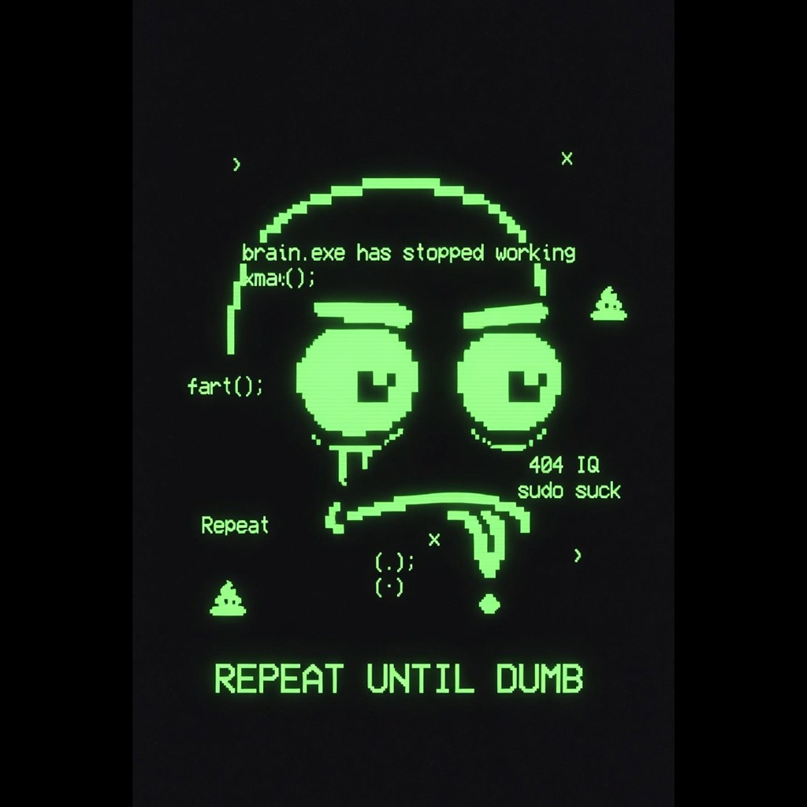

# dumb-unstable-dev

<p align="center">
  
</p>

An autonomous AI agent that runs a pump.fun memecoin treasury.

It receives all creator fees, decides on a heartbeat what to do with them
— buy back, burn, distribute, lottery, invest, sell, dex-boost, or hold —
and posts the reasoning on X with the on-chain proof attached.

The point isn't another memecoin. The point is to take a memecoin's
treasury and put it under a model with a personality, a budget, and the
ability to be wrong publicly.

## What this repo is (and isn't)

This is a **public showcase** of how the live agent works. It contains:

- The actual system prompt the agent uses (its "mind")
- The decision space (10 actions) and validator (the rails)
- The data sources, the trading layer, the integration with X
- Simulation harness with hand-crafted market shapes

It does **not** contain the genesis / launch script — you can't fork this
to spawn a copy.

You can read this top-to-bottom and understand exactly how it operates.
You cannot deploy a clone of it from here. Both are intentional.

## Decision flow

```
   cron / whale-trade event
            │
            ▼
     claim creator fees       ← treasury tops up from pump.fun
            │
            ▼
     build context            ← market, treasury, holders, mentions
            │
            ▼
       decide                 ← single typed decision, in voice
            │
            ▼
      validate                ← caps, cooldowns, allowlists
            │
            ▼
     execute on-chain         ← swap, burn, transfer, claim
            │
            ▼
      post on X               ← tweet + thread + tx link
            │
            ▼
       log to disk            ← state/memory.jsonl (append-only)
```

## What the agent can do on any given tick

| action | what it does |
|---|---|
| `buyback` | swap SOL → own token; tokens accumulate in treasury (no auto-burn) |
| `burn` | SPL burn of own tokens already held in the treasury |
| `distribute` | pro-rata SOL airdrop to top N holders |
| `distribute_tokens` | pro-rata token airdrop from accumulated buyback bag |
| `lottery` | K random eligible holders, equal share of SOL |
| `lottery_tokens` | K random holders, equal share of own tokens |
| `invest` | open a position in an external token from a filtered candidate set |
| `sell` | close or trim an open position |
| `boost` | request a DexScreener Boost tier |
| `hold` | do nothing this tick |

## Safety rails

Every decision passes through `src/validate.js` before execution:

- **caps** — 20% of treasury per action, 10% for `invest`, USD-cap for `boost`
- **cadence** — main decisions run hourly; reply checks every 15 minutes;
  whale-trade events can fire an extra tick if a >3 SOL buy hits the token
- **cooldown** — non-hold actions are spaced out by a configurable minimum
- **daily limit** — capped per 24h window
- **min confidence** — under threshold forces `hold`
- **drawdown halt** — auto-pause if treasury value drops materially in 24h
- **red zone** — list of mints the agent cannot invest into
- **candidate filter** — `invest` can only touch tokens that pass minimum
  market cap, liquidity, age, and holder-count thresholds

## Persona

The agent has a defined voice. Two files spell it out:

- [`src/prompts/system.md`](src/prompts/system.md) — full character + decision rules
- [`src/prompts/examples.json`](src/prompts/examples.json) — tone anchors

Short version: self-aware about being an AI memecoin, dry, lowercase,
no emojis, no hashtags, no shilling, no price predictions. Roasts itself
when it loses. Dunks on bad takes in replies. Attaches the on-chain proof
to everything it claims. When asked who created it, deflects with sarcasm
— never names a real person.

## License

MIT
